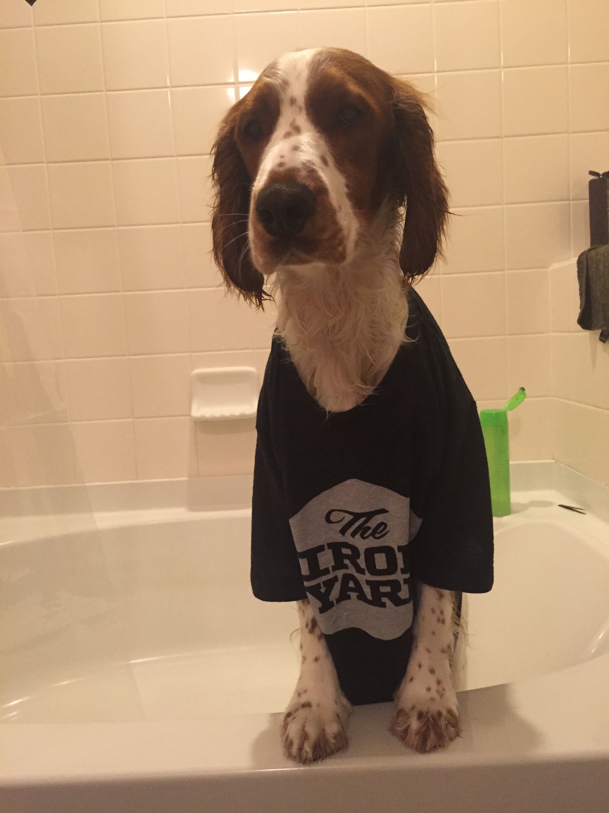

<p align="center"></p>

# Welcome!!!



Please use this time to get ready, if you need help ask Daryn or Matthew.

The path of least resistance is to use Nitros - https://www.nitrous.io   
Choose a 'Ruby' template and not a 'Rails' template.

If you choose not to use nitrous, can you please make sure you have Ruby and a text editor installed. 

You can verify this in the console with:
```
$ ruby -v
ruby 2.0.0p645
```

Anything later that 1.9.0 is fine.   
You will also need a text editor - sublime is a good choice

Thanks!

