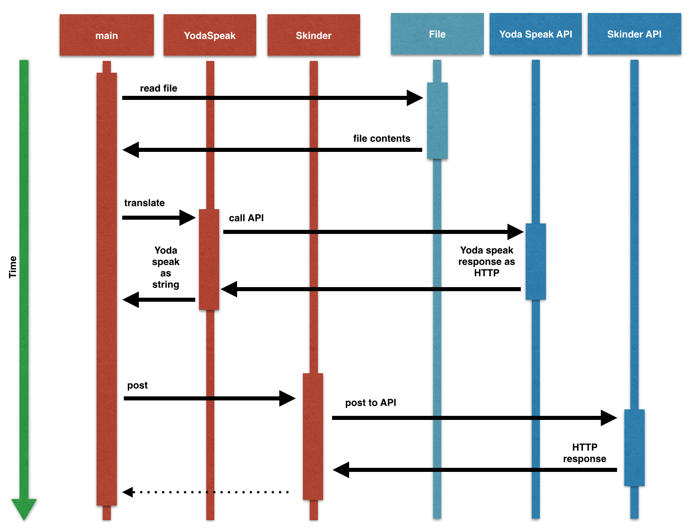

# The Challenge! 

Write a program that reads a sentence from a file, then converts that sentence into Yoda Speak. After converting it, post the result to Skinder. 

   
Sequence Diagram

To achieve this use all the existing classes:
* YodaSpeak
* Skinder

You can do this from a new file called `main.rb`. Don't forget to use `require_relative`. This will help to get you started:

```ruby
# main.rb

require_relative 'yoda_speak'
require_relative 'skinder'

# your code goes here...

```

** Congratulations! **
